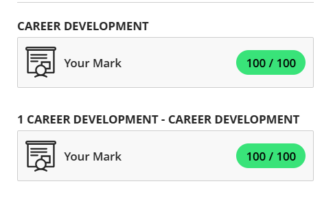
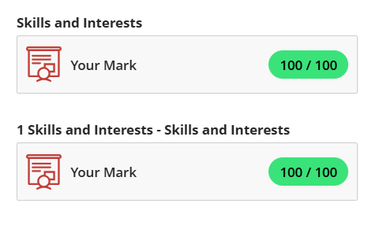
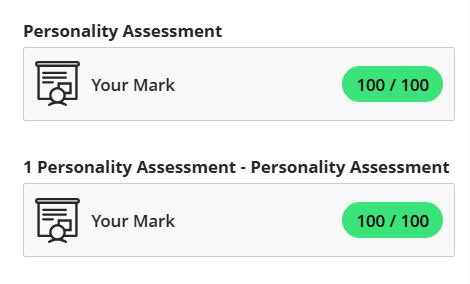

# Digital Portfolio: Work Readiness Training

## Table of Contents
- [Career Counselling](#career-counselling)
- [Skills and Interests](#skills-and-interests)
- [Personality Assessment](#personality-assessment)
- [Creating a CV](#curriculum-vitae-cv)
- [CV Submission](#cv-submission)

---

## Career Counselling

### Evidence

### Reflection (STAR Technique)
**Situation:**  
As part of the training, I completed the learning material on career counselling, which included a short quiz.

**Task:**  
To understand how to set career goals, define career planning, and differentiate between types of skills.

**Action:**  
I answered questions related to goal setting, effective counselling outcomes, and the concept of career development and planning.

**Result:**  
I gained a clear understanding of how career counselling supports long-term planning, goal setting, and skill awareness.

---

## Skills and Interests

### Evidence

### Reflection (STAR Technique)
**Situation:**  
This module focused on understanding my personal skills, values, and interests.

**Task:**  
To identify what I’m good at, what matters to me, and how those align with career paths.

**Action:**  
I completed a quiz exploring the definition of values, types of skills, and how interests guide career satisfaction.

**Result:**  
I learned that transferable skills like teamwork are highly useful across roles, and that aligning my values with job roles can lead to more fulfilling work experiences.

---

## Personality Assessment

### Evidence

  
### Reflection (STAR Technique)
**Situation:**  
This module introduced personality types and how they relate to career fit.

**Task:**  
To learn about the connection between personality traits and suitable job roles.

**Action:**  
I took a short quiz that assessed how preferences relate to personality styles and ideal careers.

**Result:**  
I found that my personality aligns with roles involving creativity and communication, helping me focus on career paths that suit my strengths and interests.

---

## Curriculum Vitae (CV)

### Evidence

### Reflection 1: Creating a CV (STAR Technique)
**Situation:**  
I completed the “Creating a CV” module to learn how to correctly and professionally create a CV.

**Task:**  
To understand each section of a CV and how to structure it effectively.

**Action:**  
I reviewed slides and answered quiz questions on section order and key content areas like work experience and skills.

**Result:**  
I now know how to organise a CV clearly and highlight work experience, education, and skills that match job requirements.

---

## CV Submission

### Evidence

[Download My CV (PDF)](Diago_Mazinyo_CV.pdf)

### Reflection 2: CV Submission (STAR Technique)
**Situation:**  
After learning the fundamentals, I created my own CV.

**Task:**  
To design a CV that accurately reflects my qualifications and experience.

**Action:**  
I used the guidelines from the training to create a well-structured document in PDF format.

**Result:**  
I produced a professional CV that I can confidently use for job or internship applications, and I now understand how to update it as I gain experience.
