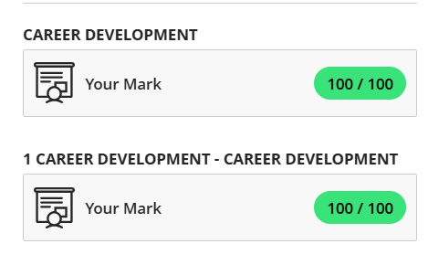
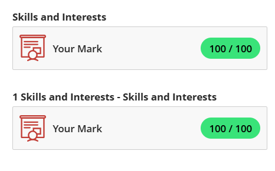
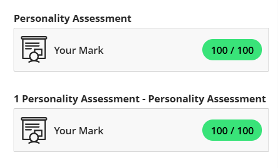
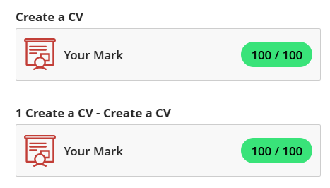
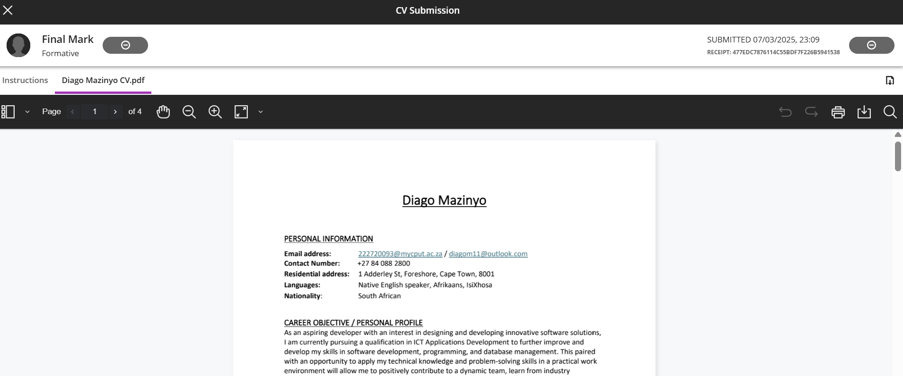
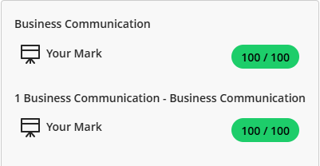
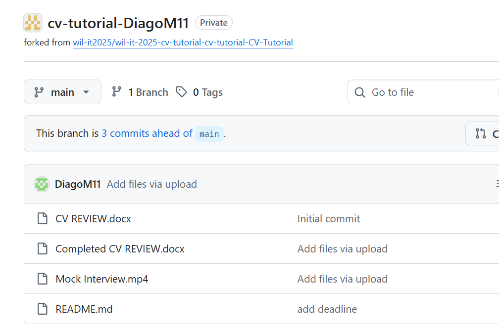
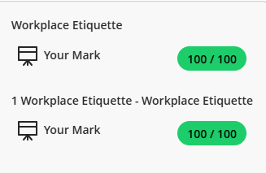

<!DOCTYPE html>
<html lang="en">
<head>
  <meta charset="UTF-8">
  <meta name="viewport" content="width=device-width, initial-scale=1">
</head>
<body>

<header>
  <h1>Digital Portfolio: Work Readiness Training</h1>
</header>

<main>

<section id="toc">
  <h2>Table of Contents</h2>
  <ul>
    <li><a href="#career-counselling">Career Counselling</a></li>
    <li><a href="#skills-and-interests">Skills and Interests</a></li>
    <li><a href="#personality-assessment">Personality Assessment</a></li>
    <li><a href="#curriculum-vitae-cv">Creating a CV</a></li>
    <li><a href="#cv-submission">CV Submission</a></li>
    <li><a href="#business-communication">Business Communication</a></li>
    <li><a href="#interview-skills">Interview Skills</a></li>
    <li><a href="#mock-interview">Mock Interview</a></li>
    <li><a href="#professional-networking">Professional Networking</a></li>
    <li><a href="#workplace-etiquette">Workplace Etiquette</a></li>
  </ul>
</section>

<section id="career-counselling">
  <h2>Career Counselling</h2>
  <h3>Evidence</h3>
  
  <h3>Reflection</h3>
  
<strong>Situation:</strong> As part of the training, I completed the learning material on career counselling, which included a short quiz.

  
<strong>Task:</strong> To understand how to set career goals, define career planning, and differentiate between types of skills.

  
<strong>Action:</strong> I answered questions related to goal setting, effective counselling outcomes, and the concept of career development and planning.

  
<strong>Result:</strong> I gained a clear understanding of how career counselling supports long-term planning, goal setting, and skill awareness.

</section>

<section id="skills-and-interests">
  <h2>Skills and Interests</h2>
  <h3>Evidence</h3>
  
  <h3>Reflection</h3>
  
<strong>Situation:</strong> This module focused on understanding my personal skills, values, and interests.

  
<strong>Task:</strong> To identify what I’m good at, what matters to me, and how those align with career paths.

  
<strong>Action:</strong> I completed a quiz exploring the definition of values, types of skills, and how interests guide career satisfaction.

  
<strong>Result:</strong> I learned that transferable skills like teamwork are highly useful across roles, and that aligning my values with job roles can lead to more fulfilling work experiences.

</section>

<section id="personality-assessment">
  <h2>Personality Assessment</h2>
  <h3>Evidence</h3>
  
  <h3>Reflection</h3>
  
<strong>Situation:</strong> This module introduced personality types and how they relate to career fit.

  
<strong>Task:</strong> To learn about the connection between personality traits and suitable job roles.

  
<strong>Action:</strong> I took a short quiz that assessed how preferences relate to personality styles and ideal careers.

  
<strong>Result:</strong> I found that my personality aligns with roles involving creativity and communication, helping me focus on career paths that suit my strengths and interests.

</section>

<section id="curriculum-vitae-cv">
  <h2>Curriculum Vitae (CV)</h2>
  <h3>Evidence</h3>
  
  <h3>Reflection</h3>
  
<strong>Situation:</strong> I completed the “Creating a CV” module to learn how to correctly and professionally create a CV.

  
<strong>Task:</strong> To understand each section of a CV and how to structure it effectively.

  
<strong>Action:</strong> I reviewed slides and answered quiz questions on section order and key content areas like work experience and skills.

  
<strong>Result:</strong> I now know how to organise a CV clearly and highlight work experience, education, and skills that match job requirements.

</section>

<section id="cv-submission">
  <h2>CV Submission</h2>
  <h3>Evidence</h3>
  
  
<a href="DiagoMazinyoCV.pdf" target="_blank">Download My CV (PDF)</a>

  <h3>Reflection</h3>
  
<strong>Situation:</strong> After learning the fundamentals, I created my own CV.

  
<strong>Task:</strong> To design a CV that accurately reflects my qualifications and experience.

  
<strong>Action:</strong> I used the guidelines from the training to create a well-structured document in PDF format.

  
<strong>Result:</strong> I produced a professional CV that I can confidently use for job or internship applications, and I now understand how to update it as I gain experience.

</section>

<section id="business-communication">
  <h2>Business Communication</h2>
  <h3>Evidence</h3>
  
  <h3>Reflection</h3>
  
<strong>Situation:</strong> I completed the Business Communication module, which focused on effective workplace communication and professional etiquette.

  
<strong>Task:</strong> To understand the principles of verbal and non-verbal communication, formal vs. informal language, tone in written messages, and appropriate behaviour during virtual meetings.

  
<strong>Action:</strong> I answered questions covering the purpose of business communication, examples of non-verbal cues, when to use formal language, and proper video conferencing etiquette.

  
<strong>Result:</strong> I learned how to tailor my communication style for different professional settings, use formal language appropriately, and maintain a respectful and clear tone in all interactions.

</section>

<section id="interview-skills">
  <h2>Interview Skills</h2>
  <h3>Evidence</h3>
  
  <h3>Reflection</h3>
  
<strong>Situation:</strong> The Interview Skills module provided insight into how to prepare for and succeed in professional interviews.

  
<strong>Task:</strong> To understand the objectives of job interviews, how to answer common questions effectively, and how to present myself confidently and authentically.

  
<strong>Action:</strong> I studied techniques like the CAR (Context–Action–Result) method, researched the importance of company research before interviews, and practiced structuring responses to various questions.

  
<strong>Result:</strong> I gained confidence in communicating my strengths and experiences clearly, and I now know how to use structured responses to leave a positive, memorable impression in interviews.

</section>

<section id="mock-interview">
  <h2>Mock Interview</h2>
  <h3>Evidence</h3>
  
  
<a href="MockInterview.mp4" target="_blank">Watch Mock Interview Video</a>

  <h3>Reflection (STAR Technique)</h3>
  
<strong>Situation:</strong> To apply what I learned, I participated in a mock interview exercise that simulated a real job interview environment.

  
<strong>Task:</strong> To practice communication, confidence, and professionalism while responding to typical interview questions.

  
<strong>Action:</strong> I prepared by reviewing interview best practices, rehearsing my responses, and applying techniques like maintaining good posture, steady eye contact, and clear articulation.

  
<strong>Result:</strong> The experience improved my self-awareness and interview performance. I learned to manage nerves, think on my feet, and present myself in a composed and professional manner.

</section>

<section id="professional-networking">
  <h2>Professional Networking</h2>
  <h3>Evidence</h3>
  
  <h3>Reflection</h3>
  
<strong>Situation:</strong> This module focused on the value of building and maintaining professional relationships for career growth.

  
<strong>Task:</strong> To learn how to engage effectively in networking events, follow professional etiquette, and create meaningful connections within my field.

  
<strong>Action:</strong> I completed quiz questions about the purpose of networking, common mistakes to avoid, and the “golden rule” of networking. I also learned practical steps for building my network.

  
<strong>Result:</strong> I now understand how networking contributes to career development. I can confidently approach professionals, nurture long-term connections, and leverage those relationships for mentorship and opportunity sharing.

</section>

<section id="workplace-etiquette">
  <h2>Workplace Etiquette</h2>
  <h3>Evidence</h3>
  
  <h3>Reflection </h3>
  
<strong>Situation:</strong> This module focused on the principles of professionalism and workplace behaviour expected in modern organisations.

  
<strong>Task:</strong> To learn how to respond appropriately to workplace challenges such as rude emails, punctuality, confidentiality, phone use, and personal matters during work hours.

  
<strong>Action:</strong> I completed questions addressing:
    <ul>
      <li>How to handle emails with a rude or offensive tone,</li>
      <li>Proper meeting arrival times,</li>
      <li>Handling confidential information,</li>
      <li>Using personal phones responsibly, and</li>
      <li>Appropriate steps for leaving early for personal reasons.</li>
    </ul>
  

  
<strong>Result:</strong> I learned that professionalism is demonstrated through courtesy, punctuality, discretion, and communication. These behaviours reflect integrity and contribute to a respectful, efficient work environment.

</section>

</main>

</body>
</html>
